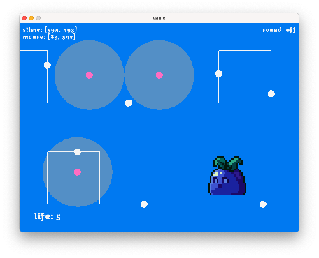

# As-of-yet untitled game thingy



A small game project to learn about rust, wasm, javascript and raylib all at the same time ✌️

The project uses [raylib-wasm](https://github.com/rakivo/raylib-wasm) library to link to raylib and compile to wasm. The library includes some functionality, and any other extensions thereto are added in `game/webhacks.rs`, in a similar style.

Assets are not included in the repo to be nice to git in terms of large files. Will become available to download somewhere at some point.

# The tricky bit(s)

The overall idea is that anything from raylib we want to work on the web we need to implement as an ffi on the javascript side. Sometimes this is rather annoying since js is running single-threaded and it *reeeally* wants you to use promises, but on the other hand raylib/rust/wasm (raystsm? rrasm? 🤨) wants things to be blocking. For example `LoadTexture` wants to return a buffer of stuff, including loaded textures' width and height, but by the time hte funciton returns the only thing we can really do synchronously is to generate the id and start the load. Only in `onload` do we know how big the texture is, but by then we already needed to have returned from the function and its too late. Any attempt to wait for the load on either the js or rrasm side results in a nasty page hardlock. Any complex objects we want to return from js to rrasm must therefore be just ids, and any properties must be queried, hence `get_texture_width` and `get_texture_height` (we can get a bunch of properties at once, as long as we don't need to wait for any of them. earlier implementation was just hacked together quickly hence two separate functions instead of `get_texture_size`). This makes the rrasm side a bit less pure-raylib and makes it work a bit harder to try to account for these quirks.

Another upshot of this is that we are not actually done with the init at the end of `game_init`! We've requested all the assets, but they will come at some point in the future, while we have to carry on with the game loop somehow. Hence we set a flag in the state to note whether the loading is actually done or not, and run `game_load` which is like the other half of `game_init` jsut int the loop, or, once loaded, `game_frame` which is the actual game logic.

Any array which is in the `State` obj must be simply serializable (not Vec's for eg, not in the web version anyway). State must, also, have a stable (aka not dynamic) and predictable layout to be able to read it back from js. Hence any dynamically-sized array (e.g. parsed animation frames data) are passed as size and pointer pair.


# Quick start

> To run natively:
```sh
cargo run --features=native
```

> To run in browser:
```sh
cargo build --target wasm32-unknown-unknown --features=web && python -m http.server   
<browser> http://0.0.0.0:8000/
```

# Working bits

By 'working' I mean on web and on my machine (macos).

- [x] Font
- [x] Music
- [x] Basic Texture loading
- [x] Basic Animations
- [x] Entities
- [ ] Entity interactions
- [ ] Life/Currency system